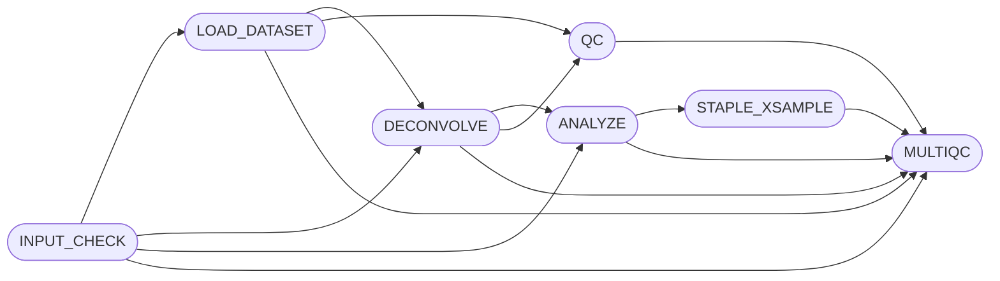

[](https://github.com/break-through-cancer/btc-spatial-pipelines/actions/workflows/test.yml)

## Introduction

**STAPLE** is a bioinformatics pipeline for 10X Visium and Visium HD spatial data. Being a simple preprocessing-deconvolution-interaction pipeline it features multiple tools for reference-free and reference-based deconvolution (cell typing) and cell-cell interaction analysis. In case of reference-based deconvolution, atlas may be fetched from a URL on an S3 location (e.g. CellxGene) or a local file, or matched-scRNA made available.





## Usage

>[!note]
If you are new to Nextflow and nf-core, please refer to [this page](https://nf-co.re/docs/usage/installation) on how
to set-up Nextflow. 

### Just trying
 Run with test data in under 10 minutes on your laptop (needs docker installed)! Enter this address `download-directory.github.io?url=https://github.com/break-through-cancer/btc-spatial-pipelines/tree/main/tests` in your browser to download ~30Mb of test data, then use the below commands in the terminal. 

```
# make a clean directory called tests
mkdir tests

# extract the downloaded archive
tar -xzvf ~/Downloads/break-through-cancer\ btc-spatial-pipelines\ main\ tests.zip -C tests

# navigate to tests/data
cd tests/data

# check that --max_memory and --max_cpus match your resources, run
nextflow run https://github.com/break-through-cancer/btc-spatial-pipelines --input samplesheets/multisample-test.csv  -profile docker --max_memory 8GB --max_cpus 4
```

Example terminal output:
```
 N E X T F L O W   ~  version 25.10.2

Launching `https://github.com/break-through-cancer/btc-spatial-pipelines` [silly_rosalind] DSL2 - revision: fbf88bd923 [main]

executor >  local (28)
[7e/6aa75d] BTC:STAPLE:INPUT_CHECK:SAMPLESHEET_CHECK (multisample-test.csv) [100%] 1 of 1 ✔
[fb/4e7ece] BTC:STAPLE:LOAD_DATASET:ADATA_FROM_VISIUM (1)                   [100%] 2 of 2 ✔
[e6/388ec7] BTC:STAPLE:LOAD_DATASET:ADATA_ADD_METADATA (sample1)            [100%] 2 of 2 ✔
[11/078f2b] BTC:STAPLE:LOAD_DATASET:ATLAS_MATCH (sample1)                   [100%] 2 of 2 ✔
[70/e190b7] BTC:STAPLE:DECONVOLVE:RCTD (sample1)                            [100%] 2 of 2 ✔
[48/59abfc] BTC:STAPLE:DECONVOLVE:RCTD_PROBS (sample2)                      [100%] 2 of 2 ✔
[8b/23b9de] BTC:STAPLE:ANALYZE:SQUIDPY:SQUIDPY_LIGREC_ANALYSIS (sample1)    [100%] 2 of 2 ✔
[db/00ca6f] BTC:STAPLE:ANALYZE:SQUIDPY_SPATIAL_PLOTS (sample1)              [100%] 2 of 2 ✔
[28/f961d1] BTC:STAPLE:ANALYZE:STAPLE_ATTACH_LIGREC (sample1)               [100%] 2 of 2 ✔
[57/3f8f75] BTC:STAPLE:QC (9)                                               [100%] 10 of 10 ✔
[76/d2f213] BTC:STAPLE:MULTIQC                                              [100%] 1 of 1 ✔
Completed at: 01-Feb-2026 12:32:04
Duration    : 6m 54s
CPU hours   : 0.9
Succeeded   : 28
```
Examinine the outputs in the `outs/` folder:
```
drwxr-xr-x@ 4 user  staff  128 Feb  1 12:25 adata
drwxr-xr-x@ 4 user  staff  128 Feb  1 12:26 atlas
drwxr-xr-x@ 4 user  staff  128 Feb  1 12:32 multiqc
drwxr-xr-x@ 8 user  staff  256 Feb  1 12:32 pipeline_info
drwxr-xr-x@ 4 user  staff  128 Feb  1 12:30 rctd
drwxr-xr-x@ 4 user  staff  128 Feb  1 12:31 squidpy
drwxr-xr-x@ 4 user  staff  128 Feb  1 12:32 staple
```

### Regular usage
First, prepare a samplesheet with your input data that looks as follows: [samplesheet.csv](samplesheet.csv), where each row represents a spatial transcriptomics sample.

The default named columns are following:

  * `sample` required, a unique identifier for the sample

  * `data_directory` required, path to the 10x spaceranger `outs` directory

  * `expression_profile`: optional, (leave blank if not using), reference expression profiles from matched scRNA (different local path to each scRNA atlas) or a local scRNA atlas (same path for each sample). If using a remotely stored atlas (such as CellXGene), rather pass `params.ref_scrna` and the atlas will be downloaded from the web.

Any extra columns will be treated as metadata and copied into the `meta` map and the resulting `.h5ad` object.


>[!IMPORTANT]
`export NXF_SINGULARITY_HOME_MOUNT=true` in order to allow matplotlib to write its logs (and avoid related error) if using singularity.

Run on segmented Visium HD with RCTD for cell typing and squipy ligand-receptor analysis (default) using remote atlas annotation. In case of CellXGene atlas, the cell type column is always `cell_type`, so it does not need to be explicitly specified.
```bash
nextflow run break-through-cancer/btc-spatial-pipelines \
   -profile <docker/singularity/.../institute> \
   --input samplesheet.csv \ 
   --outdir <OUTDIR> \
   --visium_hd 'cell_segmentations' \
   --ref_scrna https://datasets.cellxgene.cziscience.com/d1d90d18-2109-412f-8dc0-e014e8abb338.h5ad
```
In order to specify a different Visium HD resolution, change `visium_hd` param to an existing table name such as `square_008um` or `square_016um`. 

Run on Visium SD or HD with local reference atlas specified in the samplesheet:

```bash
nextflow run break-through-cancer/btc-spatial-pipelines \
   -profile <docker/singularity/.../institute> \
   --input samplesheet.csv \
   --outdir <OUTDIR>
   --ref_scrna_type_col cell_type_column_name
```

Run on Visium SD with reference-free deconvolution:

```bash
nextflow run break-through-cancer/btc-spatial-pipelines \
   -profile <docker/singularity/.../institute> \
   --input samplesheet.csv \
   --outdir <OUTDIR> \
   --deconvolve.bayestme \
```

## Limitations

Not all the tools support all the formats! Use these guidelines to pick parameters in case the fully functioning defaults (RCTD + Squidpy) are not desired.

| tool/format | Visium SD | Visium HD | HD segmented | MultiQC |
| ----------- | --------- | --------- | ------------ | ---------- |
| RCTD | OK | OK | OK | OK |
| Squidpy | OK | OK | OK | OK |
| CoGAPS | OK | reduce gene N | reduce gene N | OK |
| BayesTME | OK | | | |
| SpaceMarkers | OK | OK | | OK |


SpaceMarkers for SD reports IMscores for gene names and undirected cell type interactions (cell_type1 near cell_type2 is no different to cell_type2 near cell_type1)

SpaceMarkers for HD reports IMscores for gene names in a directed fashion (cell_type1 near cell_type2 is different to cell_type2 near cell_type1) but also reports LRscores, which are the interaction scores between genes listed in a database that SpaceMarkers uses (CellChat) by default.

Furthermore, not all the tools are fully featured in the cross-sample analysis. So, BayesTME is not yet integrated into the MultiQC module, as well as since BayesTME and CoGAPS are reference-free, the synthetic cell type outputs they produce does not match across samples.


## Contributions and Support

If you would like to contribute to this pipeline, please see the [contributing guidelines](.github/CONTRIBUTING.md).

## Citations

An extensive list of references for the tools used by the pipeline can be found in the [`CITATIONS.md`](CITATIONS.md) file.

This pipeline uses code and infrastructure developed and maintained by the [nf-core](https://nf-co.re) community, reused here under the [MIT license](https://github.com/nf-core/tools/blob/master/LICENSE).
