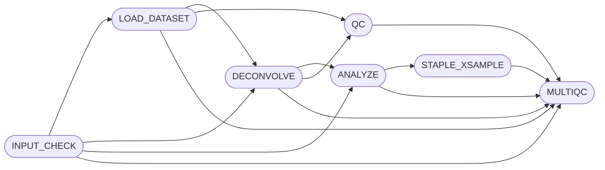

## Introduction

**STAPLE** (Spatial Transcriptomics Analysis Pipeline) is a bioinformatics pipeline for 10X Visium and Visium HD spatial data that puts the scientific question first. Features are pre-computed on a per-sample basis, then contrasted across samples using metadata provided through the sample sheet, and finally combined in a comprehensive MultiQC report for downstream analysis compatible with LLMs.

```mermaid
flowchart LR
    v1([INPUT_CHECK])
    v4([LOAD_DATASET])
    v10([DECONVOLVE])
    v16([ANALYZE])
    v25([QC])
    v31([MULTIQC])
    v20([STAPLE_XSAMPLE])
    v1 --> v4
    v1 --> v10
    v4 --> v10
    v1 --> v16
    v10 --> v16
    v16 --> v20
    v4 --> v25
    v10 --> v25
    v16 --> v31
    v1 --> v31
    v20 --> v31
    v4 --> v31
    v25 --> v31
    v10 --> v31


```

## Usage

>[!note]
If you are new to Nextflow and nf-core, please refer to [this page](https://nf-co.re/docs/usage/installation) on how
to set-up Nextflow. 

Check out the [usage documentation](docs/usage.md) for instructions on how to run the pipeline on your data. Once you have run the pipeline, jump straight to `multiqc/multiqc_report.html` to see the results of your analysis. Use MultiQC's interactive features to explore the results.

## Limitations

Not all the tools support all the formats. Use these guidelines to pick parameters in case the fully functioning defaults (RCTD + Squidpy) are not desired.

| tool/format | Visium SD | Visium HD | HD segmented | MultiQC |
| ----------- | --------- | --------- | ------------ | ---------- |
| RCTD | OK | OK | OK | OK |
| Squidpy | OK | OK | OK | OK |
| CoGAPS | OK | reduce gene N | reduce gene N | samples not integrated |
| BayesTME | OK | | | |
| SpaceMarkers | OK | OK | | OK |

SpaceMarkers for SD reports IMscores for gene names and undirected cell type interactions (cell_type1 near cell_type2 is no different to cell_type2 near cell_type1)

SpaceMarkers for HD reports IMscores for gene names in a directed fashion (cell_type1 near cell_type2 is different to cell_type2 near cell_type1) but also reports LRscores, which are the interaction scores between genes listed in a database that SpaceMarkers uses (CellChat) by default.

Furthermore, not all the tools are fully featured in the cross-sample analysis. So, BayesTME is not yet integrated into the MultiQC module, as well as since BayesTME and CoGAPS are reference-free, the synthetic cell type outputs they produce does not match across samples.

## Contributions and Support

If you would like to contribute to this pipeline, please see the [contributing guidelines](.github/CONTRIBUTING.md).

## Citations

An extensive list of references for the tools used by the pipeline can be found in the [`CITATIONS.md`](CITATIONS.md) file.

This pipeline uses code and infrastructure developed and maintained by the [nf-core](https://nf-co.re) community, reused here under the [MIT license](https://github.com/nf-core/tools/blob/master/LICENSE).
